# Yak VC — User guide

Yak VC is proximity voice chat for Minecraft. You hear players near you, from the direction they are standing, and quieter the further away they are. It is a client-only Fabric mod: servers need no plugin, but everyone who wants to talk needs the mod.

The screenshots below are taken by the mod's automated test and refreshed whenever the mod's screens change.

## Installing

1. Install [Fabric Loader](https://fabricmc.net/use/) for Minecraft 26.3, and put [Fabric API](https://modrinth.com/mod/fabric-api) in your `mods` folder.
2. Put the Yak VC jar in the same `mods` folder.
3. Add this to your launcher's JVM arguments (in the official launcher: Installations → Edit → More Options → JVM Arguments):

   ```
   --enable-native-access=ALL-UNNAMED
   ```

   Yak VC's voice engine is a native library, loaded through Java's Foreign Function & Memory API. Without the flag Java 25 prints a warning at startup, and a future Java release will refuse to load the library.

Yak VC runs on Windows (x86_64), macOS (Intel and Apple silicon) and Linux (x86_64 and ARM64).

When the game starts, Yak VC signs in to the Yak VC voice server with your Minecraft account, the same way the game does when you join a server. Your password and access token go only to Mojang, never to Yak VC.

You don't need a Minecraft account to talk on offline-mode servers (servers that don't check accounts). Without one, Yak VC signs you in *unverified*: you talk as usual there, but on servers that check accounts you get no voice, and players who turned on **Only Verified Players** don't hear you. Players with a verified account show a badge (a cyan check mark), and when a verified and an unverified player claim the same identity, the verified one wins.

## Keys

The keys are in Options → Controls → Key Binds, under **Yak VC**.

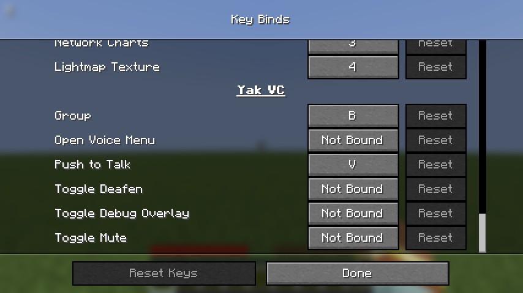

| Key | Default | What it does |
| --- | --- | --- |
| Push to Talk | V | Hold to talk. |
| Group | B | Look at a player and press it to invite them to a [group](#groups), or to accept their invite. |
| Toggle Mute | not bound | Turns your microphone off and on. |
| Toggle Deafen | not bound | Stops you hearing anyone. Your microphone still works unless you mute it too. |
| Open Voice Menu | not bound | Opens the [voice menu](#the-voice-menu), and from there the settings. |
| Toggle Debug Overlay | not bound | Shows or hides the [debug overlay](#the-debug-overlay). |

Mute, deafen, the voice menu and the debug overlay are unbound so they don't clash with other mods. The settings are always reachable without a key, from **Voice Chat…** in the game's Music & Sounds options (see [Settings](#settings)).

## The HUD

While you are in a world, a few icons in the top-left corner show how voice is doing.

| | |
| --- | --- |
|  | Ready. The microphone is white while you are silent. |
|  | Talking: your voice is going out. |
|  | Muted. |
|  | Deafened. |

Signal bars appear next to the microphone only while Yak VC isn't connected to its server: yellow while it is connecting (or trying again), and red when it can't reach it. A grey microphone with a short message means voice is off in this world:

- **Waiting for the server**: just after joining a server, until the server sends its details (at most 5 seconds).
- **Voice off: chat is disabled for this account**: see [chat restrictions](#privacy).
- **Voice off: the server opted out with [no-yakvc]**: the server owner turned Yak VC off.
- **Voice off: the engine stopped**: voice crashed; restart the game.

A grey microphone with **No microphone** means Yak VC gets no sound from your microphone: it is missing, used by another program, or blocked by your system's privacy settings. You can still hear others. A message in the top-right corner says what went wrong (see [below](#when-something-goes-wrong)), and Yak VC tries the microphone again every few seconds.

Under the icons, a speaker and a name show each player who is talking, so you know who it is even when they are behind you.

## Who is talking

A green speaker floats over the head of every player who is talking, above their name tag, with the verified badge next to it when their account is verified. It shows through walls, like name tags do. In third person you see it over your own head too.

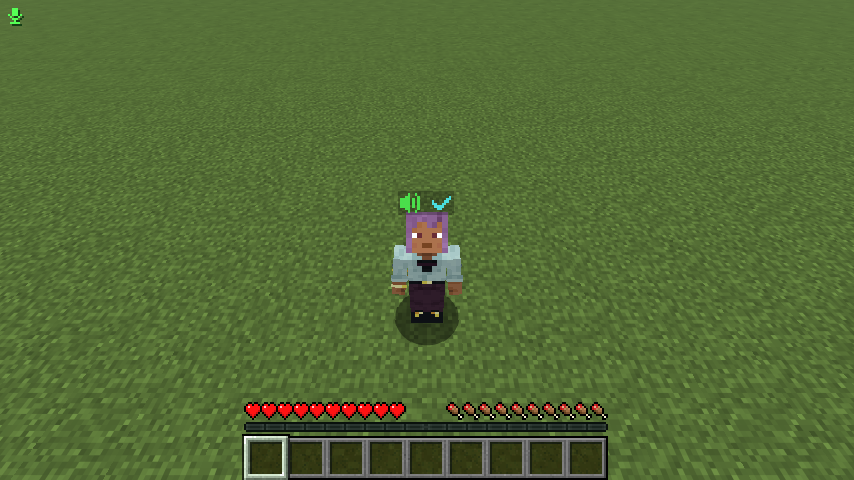

## The voice menu

Press your **Open Voice Menu** key. The top line says whether voice is connected. Below it is every other player on the server, players with voice first.

The first time you open it, a card at the top asks two things: who may invite you to a [group](#groups) (**Everyone**, **Friends** or **Nobody**) and how you talk (**Push to Talk** or **Voice**). **OK** saves both, and the card doesn't come back; both are in the [settings](#settings) too.

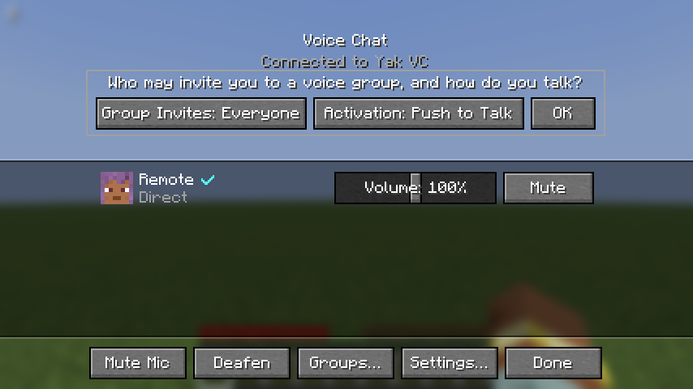

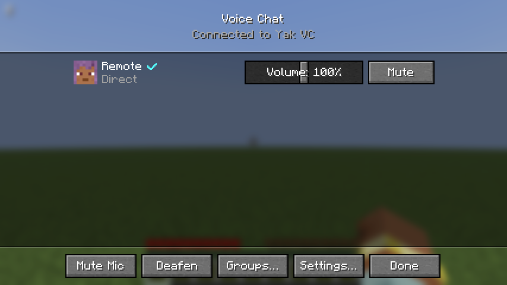

Each row shows the player's face and name, the verified badge if their Minecraft account is verified, a speaker while they talk, and their voice connection:

| Status | Meaning |
| --- | --- |
| No voice | They don't have Yak VC running, or haven't connected yet. |
| Connecting… | Yak VC is connecting to them. |
| Direct | Connected straight to them. |
| Relayed | Connected through the Yak VC relay, because a direct connection wasn't possible or one of you uses Relay Only. |
| Relay full | Your relay allowance is used up by nearer players, so they don't get your voice until a slot frees up. |
| Connection failed | Yak VC couldn't reach them, or refused them (for example an unverified player while **Only Verified Players** is on). It tries again later. |
| Blocked: muted both ways | You blocked them in Social Interactions. |

**Volume** goes from 0 to 200 % and **Mute** silences just that player; they also stop sending you their voice. Both are remembered for that player, on every server.

At the bottom: **Mute Mic**, **Deafen**, **Groups…**, **Settings…** and **Done**.

## Groups

Players in a group hear each other wherever they are on the server, as if standing next to each other, without direction, and only each other: while you are in a group, players near you who aren't in it don't hear you, and you don't hear them. Push to Talk (or *Voice* activation) works the same as outside a group.

**Making a group.** Look at a player and press **Group** (B). They see in chat that you invited them, for example *Steve invited you to a group. Look at them and press B.* When they look at you and press their Group key within two minutes, you are both in the group. Anyone in a group can invite more players the same way, and accepting an invite leaves the group you were in. A group is made face to face, so the player has to be in view; who may invite you is the **Group Invites** setting.

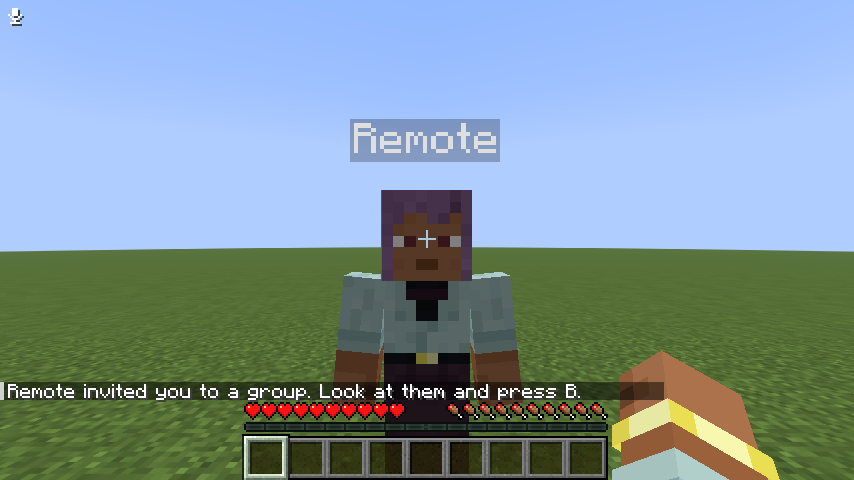

When someone joins or leaves your group, or changes it, a message shows in the top-right corner: *Alex joined the group*, *Alex left the group*, *Steve made the group public*, *Steve changed the group label*, or *You were kicked from the group*.

**The groups screen.** Open **Groups…** in the voice menu. Each group is a box of its members' faces (point at a face to see the name), with its label above if it has one.

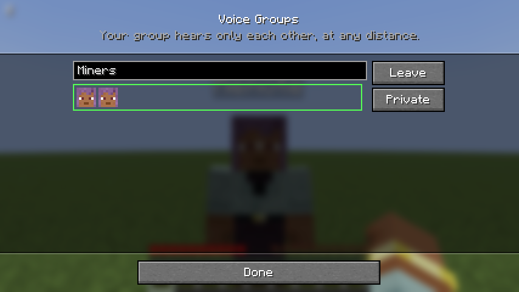

- **Your group** comes first. **Leave** leaves it. **Private** or **Public** switches who can see it: a private group is seen only by its members; a public one is listed for everyone on the server, and anyone may **Join** it. Type a label of up to 32 characters above the faces and press Enter to set it; leave it empty for none.
- **Public groups** of other players follow, each with **Join**.
- Groups have no leader: every member can invite, change the label or the public setting, or start a vote to kick someone. You can be in one group at a time, and you leave it when you leave the server.
- Mute, volume, deafen and blocking work in groups as everywhere else. What you say in a group is encrypted like all voice.

**Kicking someone.** Type `/yakvc kick <player>` in chat (Tab suggests your group mates). The other members see *Steve wants to kick Alex from the group.* with **[Yes]** and **[No]** to click, and each vote shows how far it has got, for example *Vote to kick Alex: 2 of 3*. When more than half of the other members vote yes within a minute, Alex is out of the group. A kicked player can join a public group again; make it private to keep them out.

The game's own Voice/Speech slider (Options → Music & Sounds) sets the volume of all voices, together with Master.

## Settings

Open the settings from **Options → Music & Sounds → Voice Chat…**, at the end of the sound options, which works on the title screen as well as in game. **Settings…** in the voice menu opens them too, and so does [Mod Menu](https://modrinth.com/mod/modmenu) if you have it installed: in its **Mods** list, select Yak VC and press the small settings button at the right of its name. **Done** goes back to where you came from. Changes apply and are saved when you leave the screen.

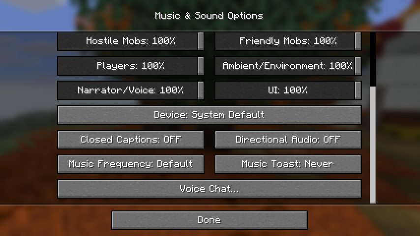

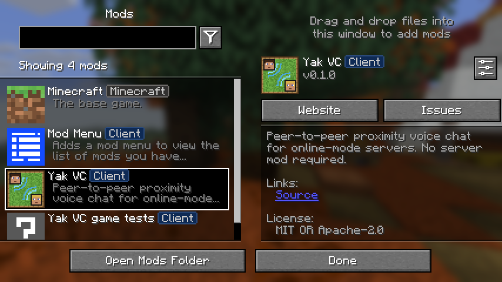

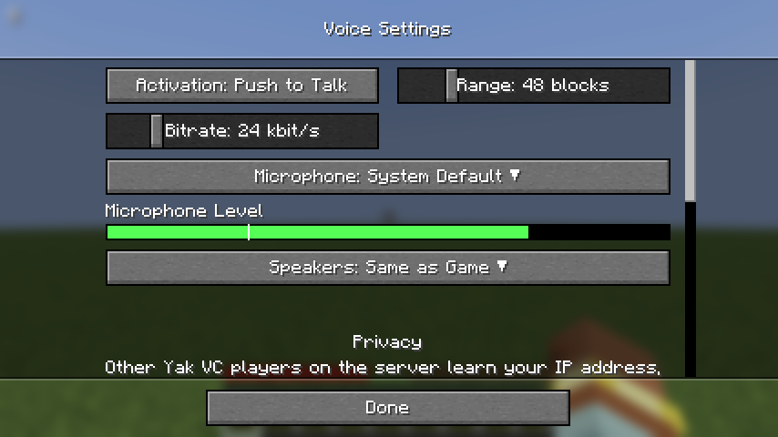

- **Activation**: *Push to Talk* sends your voice only while you hold the key. *Voice* sends it whenever the microphone hears you speak.
- **Range**: how far away players can hear you and you can hear them, from 1 to 256 blocks (48 by default). Between two players, the shorter of their ranges applies.
- **Bitrate**: the sound quality of your voice, from 16 to 64 kbit/s. Higher sounds better and uses more data; 24 kbit/s is plenty for speech.
- **Microphone**: which microphone to use. Click it for a list of your microphones and pick one; scroll the list if it is long. *System Default* follows your system's setting.
- **Microphone Level**: shows live how loud your microphone hears you, so you can check it works without joining a world or holding the talk key. The bar turns green above the white mark, the level at which *Voice* activation starts sending (`vad_threshold_db` in the [config file](#the-config-file)). It shows the microphone in use, so after picking another one, leave and reopen the settings to see it.
- **Speakers**: where voices play. Click it to pick from a list, like the microphone. *Same as Game* uses the game's sound device (Options → Music & Sounds → Device).

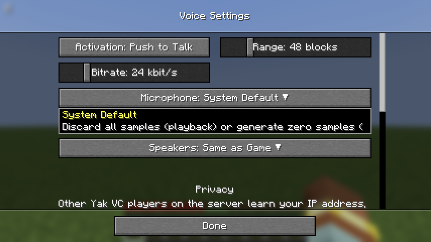

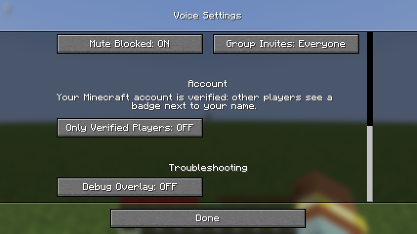

- **Relay Only**: sends all voice through the Yak VC relay, so other players don't learn your IP address (see [privacy](#privacy)). Off by default. It takes effect after you restart the game.
- **Obey Chat Limits**: turns voice off while your Microsoft account or launcher disables chat. On by default.
- **Mute Blocked**: players you block in Social Interactions can't hear you, and you don't hear them. On by default.
- **Group Invites**: who may invite you to a [group](#groups): *Everyone* (the default), *Friends* (the players in `friends_only` in the [config file](#the-config-file)) or *Nobody*. Invites from anyone else are ignored.

Under **Account** the settings say whether your Minecraft account is verified (see [Installing](#installing)).

- **Only Verified Players**: talk only with players whose Minecraft account is verified, the ones with the badge. Players without an account, as on offline-mode servers, can't hear you and you don't hear them. Off by default.

Under **Troubleshooting**:

- **Debug Overlay**: shows the [debug overlay](#the-debug-overlay). It switches on and off at once and isn't saved, so it is off again after a restart.

## Privacy

- **Other players learn your IP address.** Voice goes straight from player to player, and Yak VC connects to every Yak VC player on the server as soon as you both join, so all of them can see your IP address, not just the ones near you. On a server network with one shared player list, that is every Yak VC player on the network. Turn on **Relay Only** to hide it: everything then goes through the Yak VC relay. A relay has limited room, so with Relay Only about 11 nearby players can hear you at once; the nearest get it first.
- **You talk only to players you can see nearby, or to your group.** Yak VC sends your voice only to players your game shows within range, and plays only theirs; in a [group](#groups), only to and from its members, wherever they are. Outside a group, spectators neither hear nor are heard. Voice is encrypted from player to player; the relay only passes on encrypted data.
- **The Yak VC server** learns which Yak VC players are on a server together and their IP addresses, but never hears what you say, and it keeps no record of who played with whom. Your game sends it the rest of the player list only as scrambled codes, but player IDs are public, so it could work out who is on your list.
- **Chat restrictions.** If your Microsoft account (for example a child account) or your launcher turns chat off, Yak VC turns voice off too. **Obey Chat Limits** controls this.
- **Blocked players.** Anyone you block in Social Interactions is muted both ways. **Mute Blocked** controls this.
- **Server owners** can ask Yak VC to stay off: put `[no-yakvc]` anywhere in the server's MOTD, and Yak VC turns itself off for everyone on that server. Nothing enforces this; the mod simply honours it.

## When something goes wrong

Yak VC shows a message in the top-right corner when voice, or a part of it, stops working:

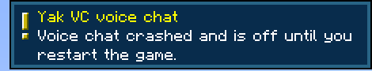

| Message | What to do |
| --- | --- |
| Voice chat doesn't support this system yet. | Your system isn't one of those listed under [Installing](#installing). |
| Voice chat couldn't load its engine. See the game log. | Download the Yak VC jar again and replace the old one. Antivirus software can also block the library Yak VC unpacks into `config/yakvc/natives/`. |
| Voice chat couldn't start: … | Usually a mistake in `config/yakvc/client.toml`; the message says which. Fix it, or delete the file to get the defaults back. |
| Voice chat crashed and is off until you restart the game. | Restart the game. If it keeps happening, report it with your game log. |
| Settings not applied: … | A setting was refused; the message says why. Nothing was changed. |
| Settings applied but not saved. See the game log. | The settings work until you quit, but Yak VC couldn't write its config file, for example because it is read-only. |
| Cannot open the microphone: … or The microphone stopped working: … | Check that the microphone is plugged in, not used by another program, and allowed for Java in your system's privacy settings, or pick another one under **Microphone** in the settings. Yak VC keeps trying, and the HUD's microphone turns white again once it works. |
| Cannot open the speakers: … or The speakers stopped working: … | The same for your speakers or headphones, under **Speakers**. You can still talk. |
| Voice chat sign-in failed: … | The Yak VC server didn't accept your Minecraft account; the message says why. Yak VC tries again by itself. |

A message that keeps coming back, such as a sign-in that fails at every try, shows at most once every five minutes.

The game log is `logs/latest.log` in your game folder; Yak VC's lines contain `(yakvc)`.

### The debug overlay

For testing, or to attach to a bug report, the debug overlay shows what Yak VC is doing in the top-right corner, a bit like F3. Turn it on with **Debug Overlay** in the settings, or bind **Toggle Debug Overlay** in the key binds. It updates four times a second.

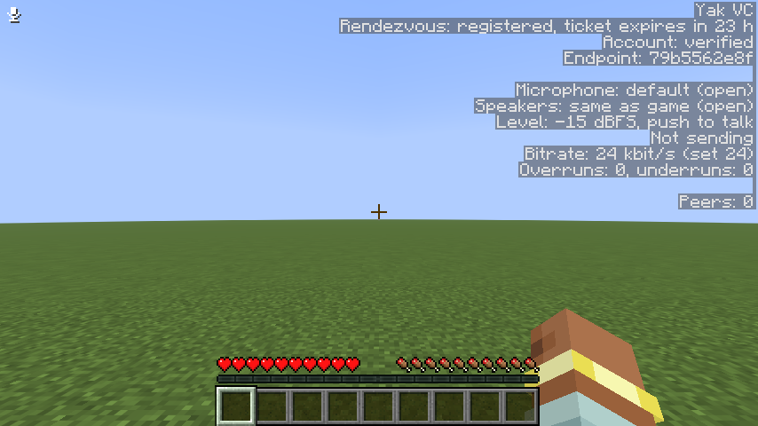

| Line | Meaning |
| --- | --- |
| Rendezvous | The connection to the Yak VC server: `connecting`, `authenticating`, `registered` (with how long your sign-in ticket has left), `retrying in` some seconds, or `disconnected`. |
| Account | Whether the server verified your Minecraft account. |
| Endpoint | The start of your Yak VC address, which other players' logs show too; `relay only` when **Relay Only** is on. |
| Microphone, Speakers | The device from the settings, and whether it is open. `not open` means Yak VC can't use it; the game log says why. |
| Level | Your microphone's loudness, and how you talk: push to talk, or voice above the activation threshold. |
| Sending | Whether your voice is going out right now; also `muted` or `deafened`. |
| Bitrate | The quality your voice is sent at now, and the setting. It drops below the setting when the relay is busy. |
| Overruns, underruns | Glitches since the device opened: microphone audio Yak VC was too slow to pick up, and moments the speakers ran dry. A count that keeps rising means crackling. |
| Peers | One line per Yak VC player you are connected to: `direct` or `relayed` (or `connecting`, `failed`, `relay full`), `verified` if their account is, the round trip time (`rtt`), the share of their voice lost on the way (`loss`), packets that came too late to play (`late`), and how much audio is held back to smooth out uneven arrival (`buffer`). Loss and late appear once they have talked. |

## The config file

Settings live in `config/yakvc/client.toml` in your game folder. Yak VC writes it with comments the first time it starts, and the settings screen edits it in place, so your own comments survive. The game reads the file when it starts, so edit it by hand only while the game is closed.

The keys that the settings screen shows:

| Key | Default | Setting |
| --- | --- | --- |
| `voice_range` | `48.0` | Range |
| `relay_only` | `false` | Relay Only |
| `respect_chat_restrictions` | `true` | Obey Chat Limits |
| `mute_blocked_players` | `true` | Mute Blocked |
| `verified_only` | `false` | Only Verified Players |
| `invites` | `"everyone"` | Group Invites (`"everyone"`, `"friends"` or `"nobody"`) |
| `[audio]` `activation` | `"push_to_talk"` | Activation (`"push_to_talk"` or `"voice"`) |
| `[audio]` `bitrate` | `24000` | Bitrate, in bits per second |
| `[audio]` `input_device` | unset | Microphone, by device id |
| `[audio]` `output_device` | unset | Speakers, by device id |

A few more are only in the file:

| Key | Default | What it does |
| --- | --- | --- |
| `friends_only` | unset | A list of player UUIDs, like `["11111111-2222-3333-4444-555555555555"]`. When set, you hear and talk to only these players. |
| `setup_done` | `false` | Set once the voice menu's first-run card is dismissed, so it shows only once. |
| `[audio]` `noise_suppression` | `true` | Filters background noise out of your microphone. |
| `[audio]` `input_gain` | `1.0` | Microphone volume, from 0 to 10. |
| `[audio]` `vad_threshold_db` | `-45.0` | How loud you must be for *Voice* activation to send, from -100 (everything) to 0 (very loud only). |
| `[rendezvous]` | the Yak VC server | Another voice server, for those who [run their own](../deploy/README.md). |

The same folder holds `players.json`, the volume and mute you set for each player, and `node.key`, the private key that identifies your game to other players. Keep it to yourself; if you delete it, Yak VC makes a new one.
